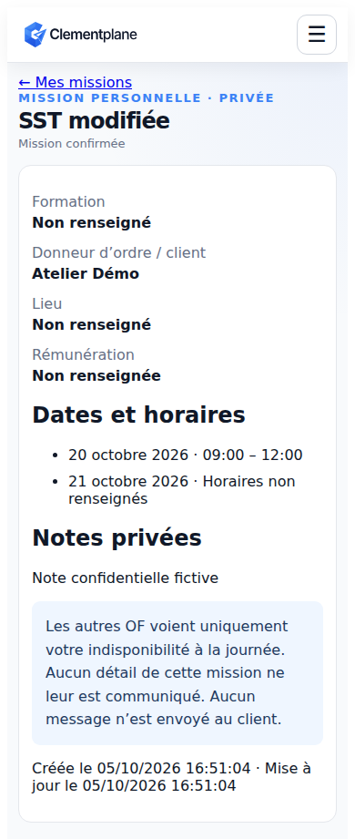

# Ajouter une mission personnelle

Version v0.21.1 en préparation. Capture de la vraie interface locale, avec données entièrement fictives et API de test simulée.

1. Dans l’accueil formateur, Mes missions ou Mon planning, choisissez **Ajouter une mission**.
2. Renseignez l’intitulé et une première date. Ajoutez d’autres dates si nécessaire. Les horaires sont facultatifs et doivent être saisis par paire.
3. Complétez si utile le client, le lieu, la formation, les notes et une rémunération HT avec son unité. Mes OF permet uniquement de recopier un nom.
4. Enregistrez. La mission est confirmée sans validation d’un OF et apparaît dans les mêmes listes et agenda que vos missions reçues.
5. Depuis le détail, choisissez **Modifier** ou **Annuler la mission**. L’annulation conserve une trace et demande confirmation.

Les OF voient une indisponibilité neutre pour toute la journée ; aucun titre, client, tarif, note ou horaire n’est partagé. Aucun message n’est envoyé au client. Les conflits sont signalés sans bloquer. La connexion est nécessaire ; aucune synchronisation Google/Outlook/Apple dans cette version.
