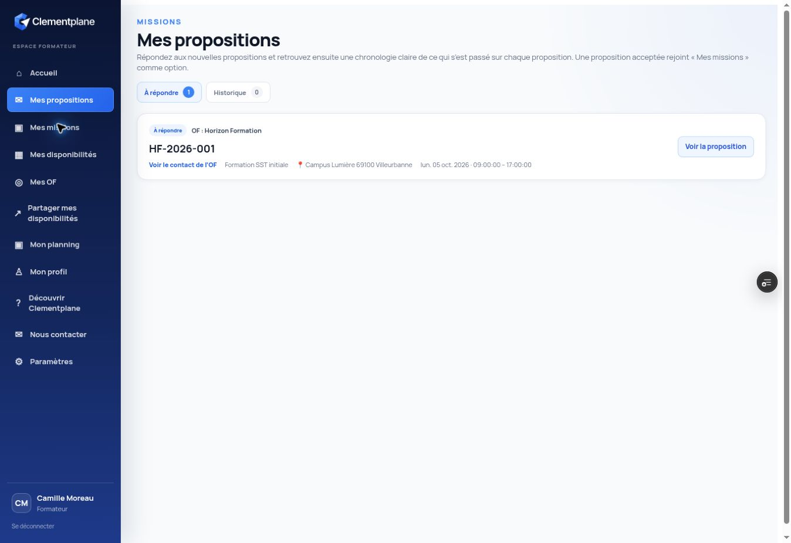
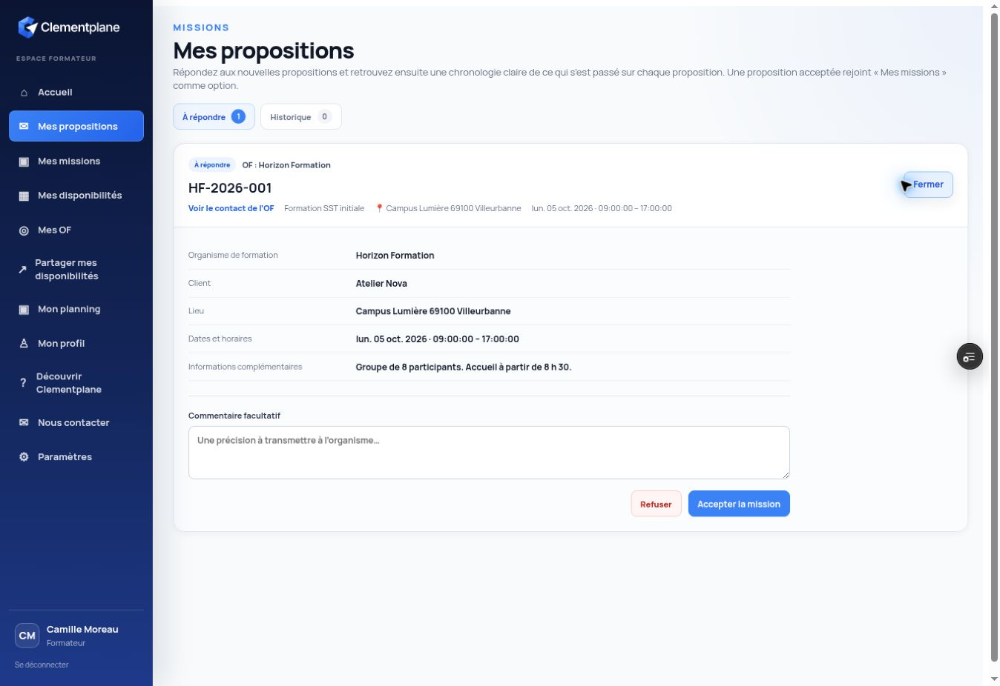
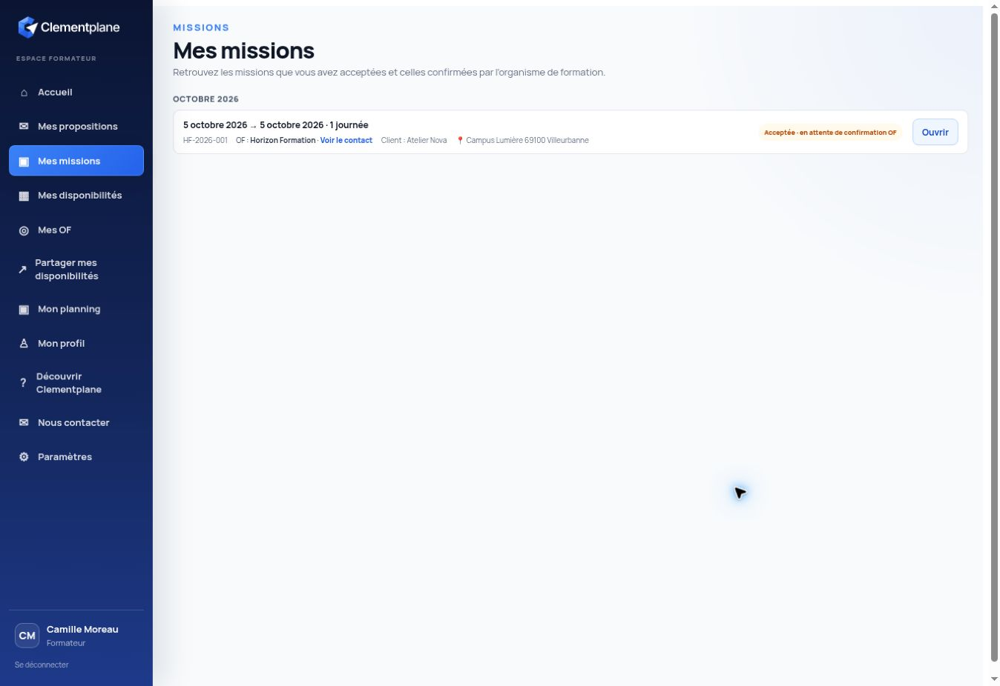
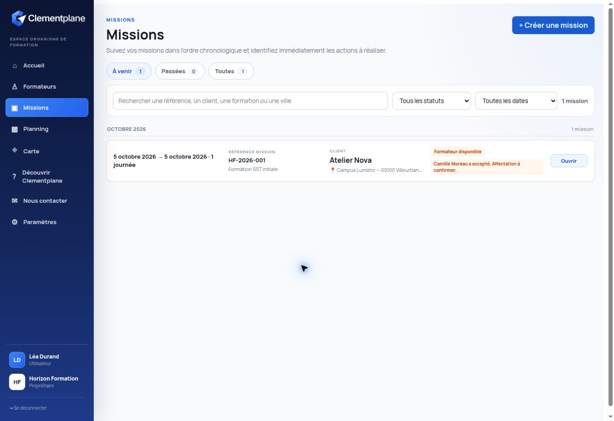
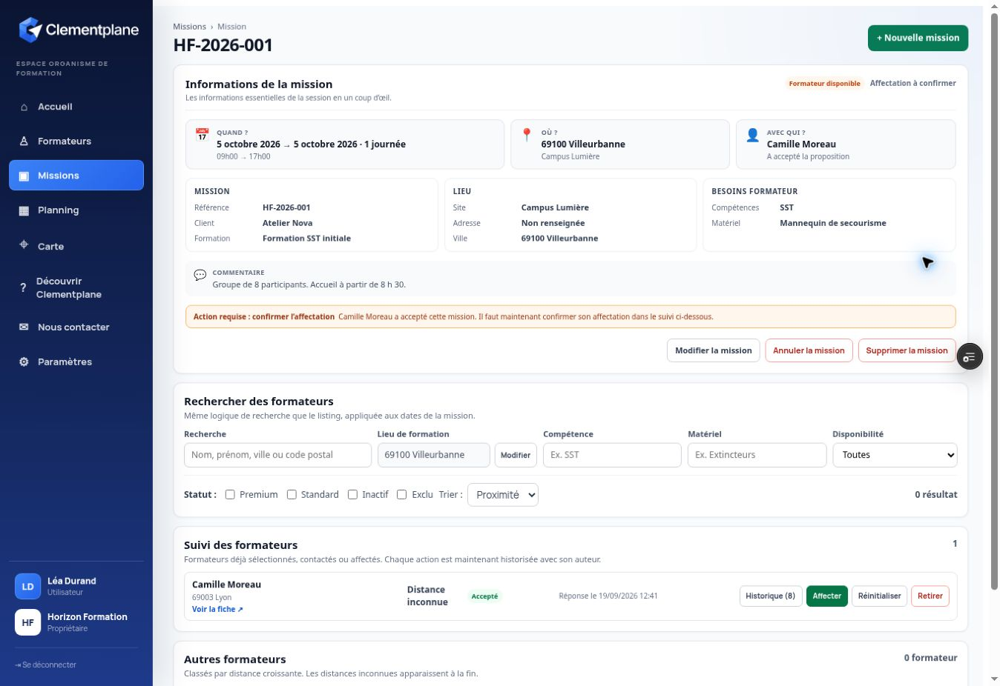
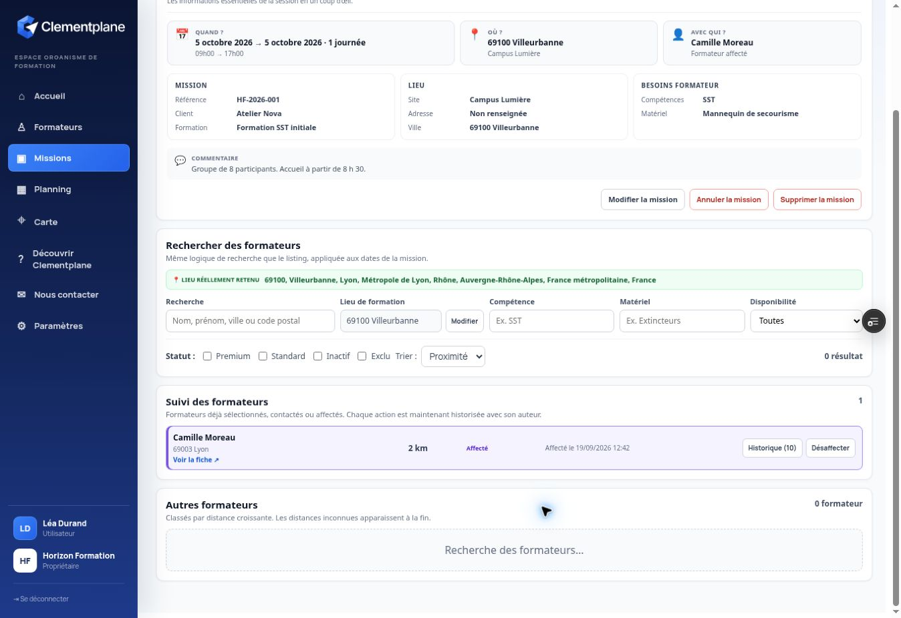
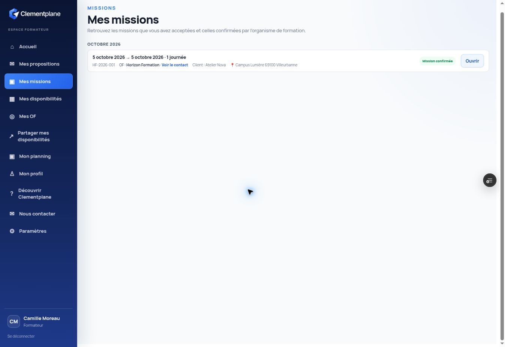

# Répondre à une proposition de mission et comprendre la suite

**Public :** Formateur et organisme de formation

**Type :** Parcours croisé Formateur ↔ OF

**Durée estimée :** 3 minutes

**Résultat :** le formateur accepte la proposition, puis l’OF confirme son affectation.

> Les personnes, organismes, clients, lieux et missions visibles dans ce tutoriel sont entièrement fictifs.

## Côté formateur — consulter et accepter la proposition

### 1. Ouvrez « Mes propositions »

La pastille **À répondre** indique le nombre de propositions qui attendent votre décision. Repérez la mission, puis cliquez sur **Voir la proposition**.

### 2. Vérifiez toutes les informations

Avant de répondre, contrôlez l’organisme de formation, le client, le lieu, la date, les horaires et les informations complémentaires.

Vous pouvez ajouter un commentaire facultatif. Il sera transmis à l’organisme avec votre réponse.

Cliquez ensuite sur **Accepter la mission**. Si vous n’êtes pas disponible ou si les conditions ne vous conviennent pas, cliquez sur **Refuser**.

### 3. Après votre acceptation

La proposition disparaît de **À répondre** et rejoint **Mes missions** avec le statut **Acceptée · en attente de confirmation OF**.

À ce stade, vous avez donné votre accord, mais la mission n’est pas encore définitivement confirmée. L’organisme de formation doit encore vous affecter.

## Que se passe-t-il ensuite côté organisme de formation ?

### 4. L’OF voit immédiatement votre réponse

Dans la liste **Missions**, la mission passe au statut **Formateur disponible**. Le message précise que vous avez accepté et que l’affectation reste à confirmer.

L’OF doit ouvrir la mission pour terminer le processus.

### 5. L’OF confirme l’affectation

Dans la mission, Clementplane affiche l’action requise : **confirmer l’affectation**. Votre fiche porte le statut **Accepté** et le bouton **Affecter** devient disponible.

Lorsque l’OF clique sur **Affecter**, il choisit comment vous informer. Selon son choix, Clementplane peut envoyer un e-mail immédiatement ou simplement enregistrer qu’un autre moyen de contact a été utilisé.

### 6. La mission devient affectée

Après confirmation, la mission porte le statut **Affectée** et votre fiche indique **Affecté**. Le processus est terminé côté OF.

## Résultat final côté formateur

### 7. La mission est confirmée

Dans **Mes missions**, le statut devient **Mission confirmée**. La mission apparaît également dans votre planning et sur votre tableau de bord parmi les missions confirmées.

## À retenir

- **Accepter** une proposition ne confirme pas encore définitivement la mission.
- L’OF doit ensuite cliquer sur **Affecter**.
- Le processus est réellement terminé lorsque le formateur voit **Mission confirmée** et que l’OF voit **Affectée**.
- Une proposition acceptée constitue une option ; l’affectation par l’OF la transforme en mission confirmée.
